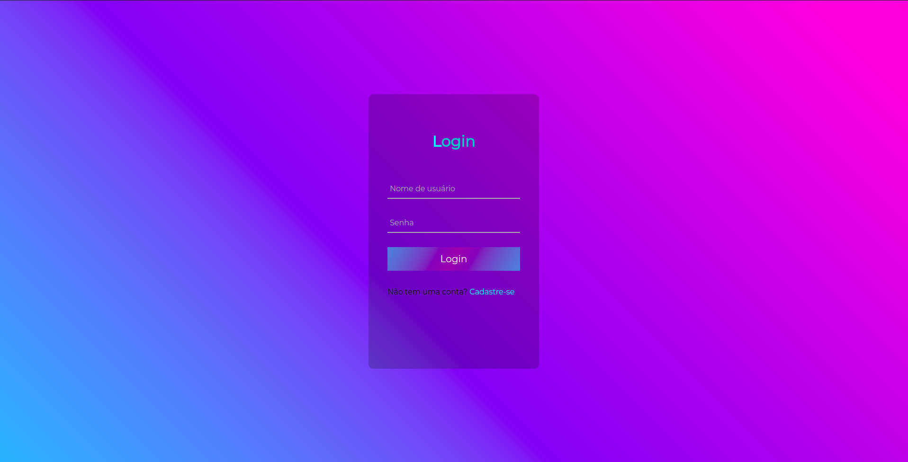
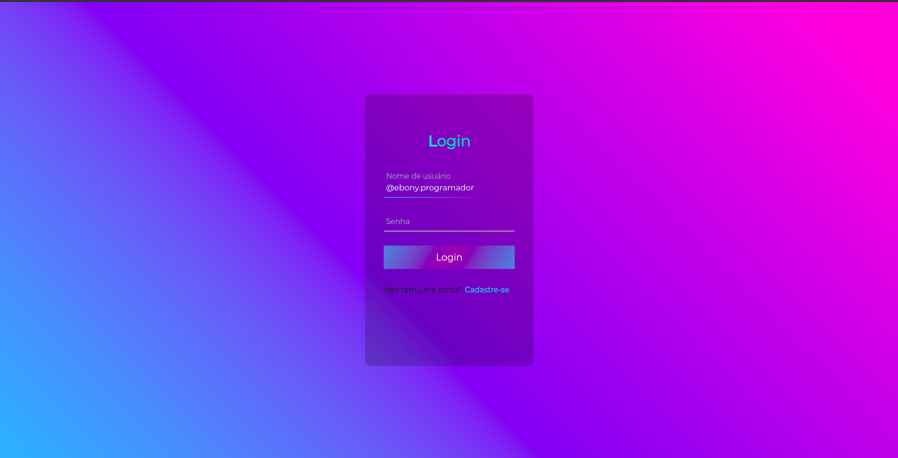
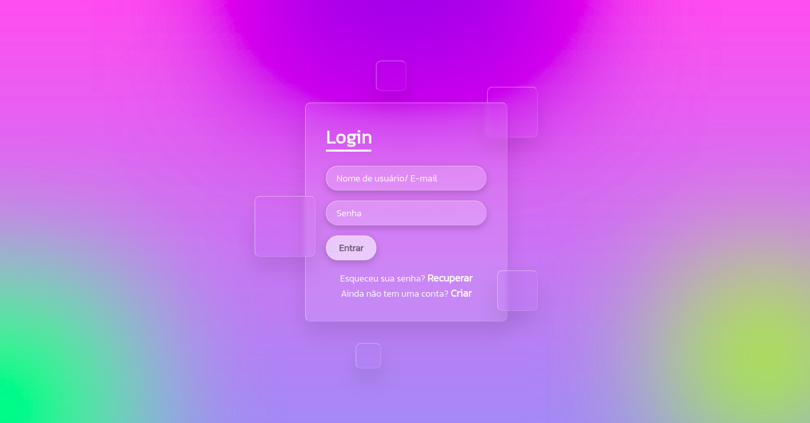
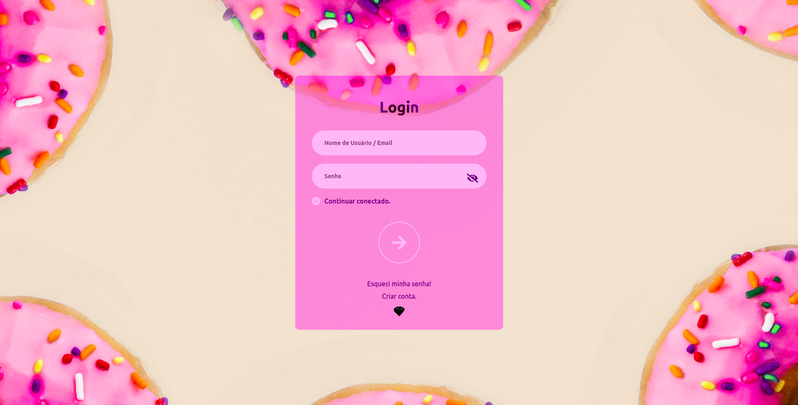
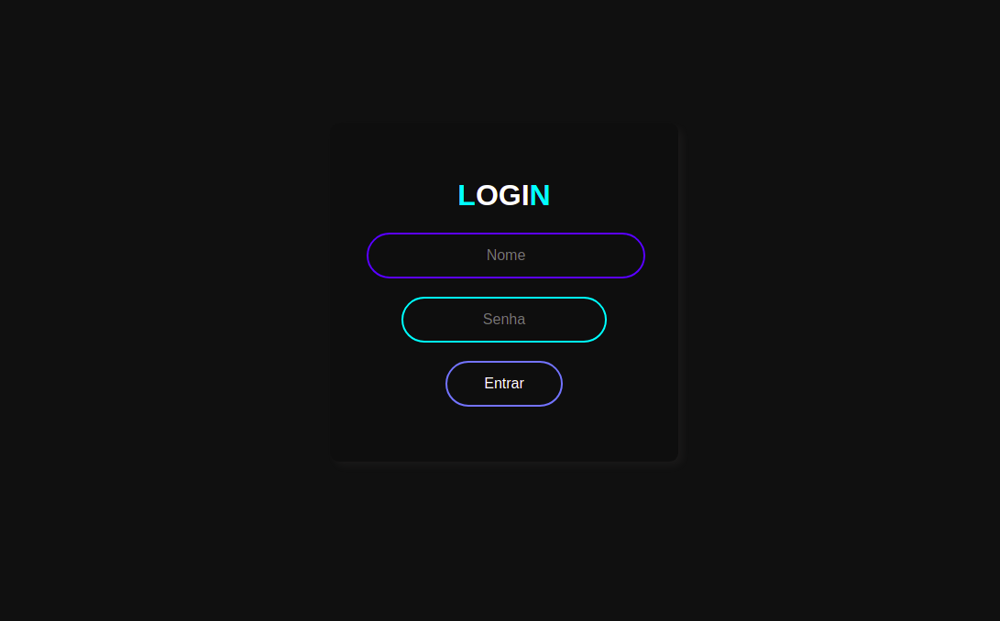
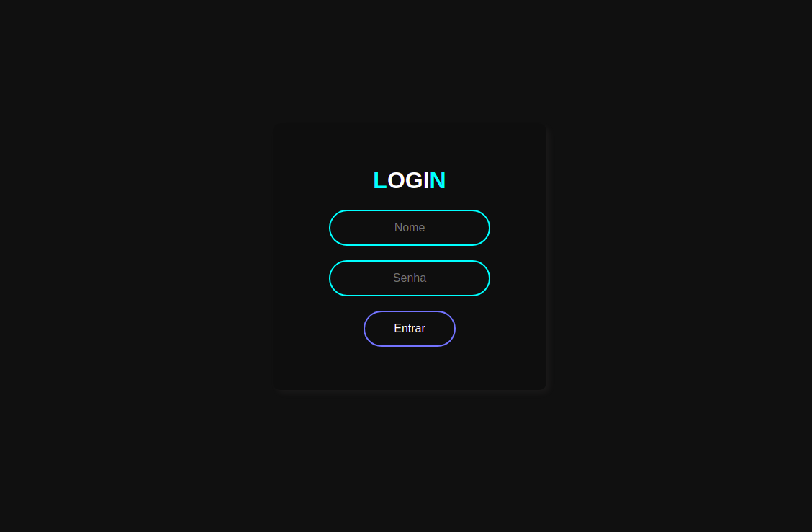
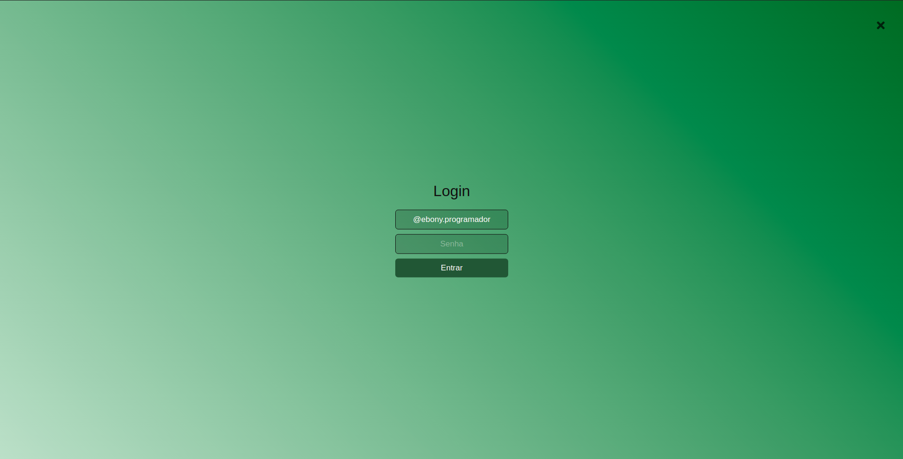
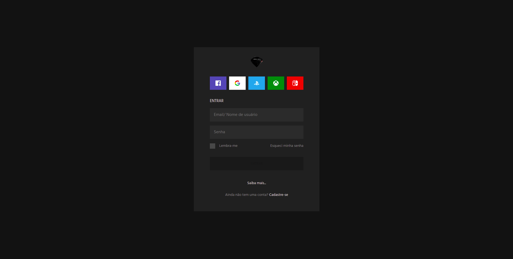

# Logins examples

 
  Variadas telas de login, com os mais diversos estilos, efeitos, validações e etc... desenvolvidas por mim e/ou sendo referenciadas por projetos de aulas, vídeos tutoriais... em suma, trago aqui exemplos que já testei para projetos de estudo e profissionais...  ...mais informações >>> <a href="https://api.whatsapp.com/send?phone=5511979714423">WhatsApp</a>
  
  <ul>
    Desenvolvida em:
    <li>HTML 
    <li>CSS
    <li>JAVASCRIPT 
  </ul>

         

 ### Transparent 1        
 <table>
  <tr>
    <td>
      
    </td>
    </td>
    </td>
    <td>
         
    </td>
  </tr>
</table> 

### Transparent 2        
 <table>
  <tr>
    <td>
      
    </td>
    </td>
    </td>
    <td>
         
    </td>
  </tr>
</table> 

### Transparent 3       
 <table>
  <tr>
    <td>
      
    </td>
    </td>
    </td>
    <td>
         
    </td>
  </tr>
</table> 

 ### Ligth 1        
 <table>
  <tr>
    <td>
      
    </td>
    </td>
    </td>
    <td>
         
    </td>
  </tr>
</table> 

### Ligth 2        
 <table>
  <tr>
    <td>
      
    </td>
    </td>
    </td>
    <td>
         
    </td>
  </tr>
</table> 

 ### Dark 1        
 <table>
  <tr>
    <td>
      
    </td>
    </td>
    </td>
    <td>
         
    </td>
  </tr>
</table>                                                        

### Dark 2
 <table>
  <tr>
    <td>
      
    </td>
    </td>
    </td>
    <td>
         
    </td>
  </tr>
</table>   

### Dark 3
 <table>
  <tr>
    <td>
      
    </td>
    </td>
    </td>
    <td>
         
    </td>
  </tr>
</table> 
