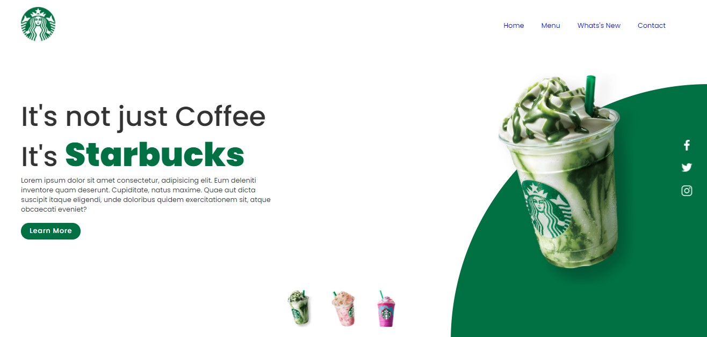

# Diversos mini projetos em Js.

### Linguagem principal
* Javascript

### Técnologias
* HTML 5
* CSS 3

<h4 align="center"> Starbucks </h4>

<table>
 <tr>
  <td>
   
  </td>
 </tr>
</table> 

<table>
 <tr>
  <td>
   
  </td>
  <td>
   
  </td>
 </tr>
</table>

<h4 align="center"> Jogo da Velha </h4>

<table>
 <tr>
  <td>
   
  </td>
 </tr>
</table> 

<table>
 <tr>
  <td>
   
  </td>
  <td>
   
  </td>
 </tr>

 <tr>
  <td>
   
  </td>
  <td>
   
  </td>
 </tr>

</table>

<h4 align="center"> Restaurante - Responsivo </h4>

<table>
 <tr>
  <td>
   
  </td>
 </tr>
</table> 

<table>
 <tr>
  <td>
   
  </td>
  <td>
   
  </td>
 </tr>

</table>

Acompanhe o desenvolvimento → [Canal códigos simples](https://www.youtube.com/channel/UC8fRZfYGd21_D8DwuEcFuHw)
 ...mais informações → <a href="https://api.whatsapp.com/send?phone=5511979714423">WhatsApp</a>

