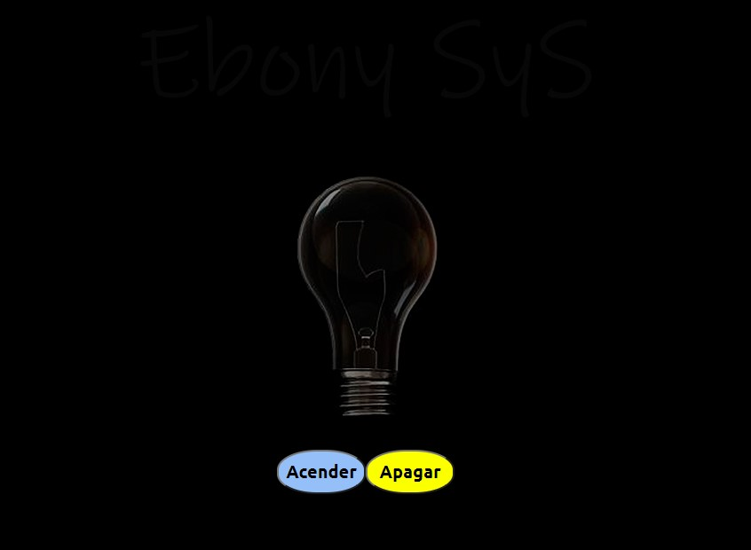
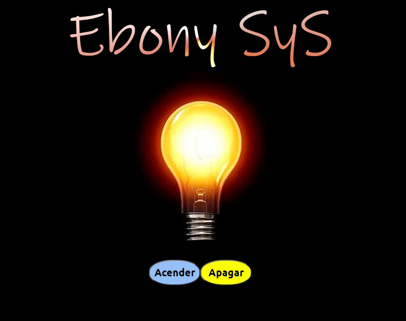

<h4 align="center"> Lâmpada </h4>

Site de brincadeira, acende e apaga a lâmpada, vai lá,
dá uns cliques nele rs...

 

<table>
 <tr>
  <td>
   
  </td>
  <td>
   
  </td>
 </tr>

</table>

Acompanhe o desenvolvimento → [Canal códigos simples](https://www.youtube.com/channel/UC8fRZfYGd21_D8DwuEcFuHw)
 ...mais informações → <a href="https://api.whatsapp.com/send?phone=5511979714423">WhatsApp</a>

