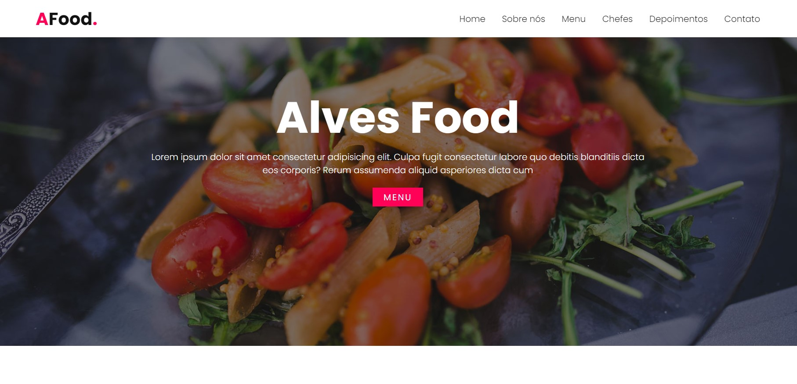
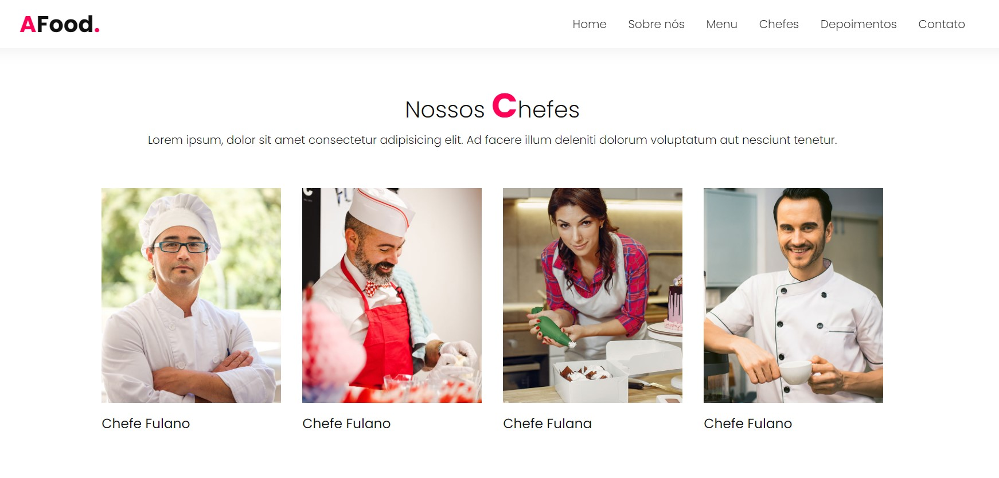

# Restaurante - responsivo.

    Neste projeto um <i>template</i> de uma versão 
    de aplicações para <b>RESTAURANTES</b>. Apenas com fito de
    estudo.
    Utilize como preferir, muitos efeitos e interações 
    podem ser reaproveitas em outros projetos, assim como a alteração
    para quaisquer outros projetos que necessitar.

<table>
 <tr>
  <td>
   
  </td>
 </tr>
</table> 

<table>
 <tr>
  <td>
   
  </td>
  <td>
   
  </td>
 </tr>
</table>

>Quer contribuir? Seja muito bem vindo e <b>vambóóóra!</b>

 

Acompanhe o desenvolvimento → [Canal códigos simples](https://www.youtube.com/channel/UC8fRZfYGd21_D8DwuEcFuHw)
 ...mais informações → <a href="https://api.whatsapp.com/send?phone=5511979714423">WhatsApp</a>

