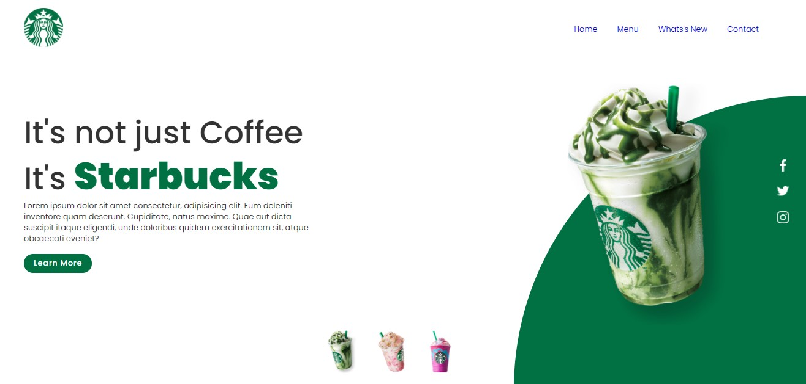
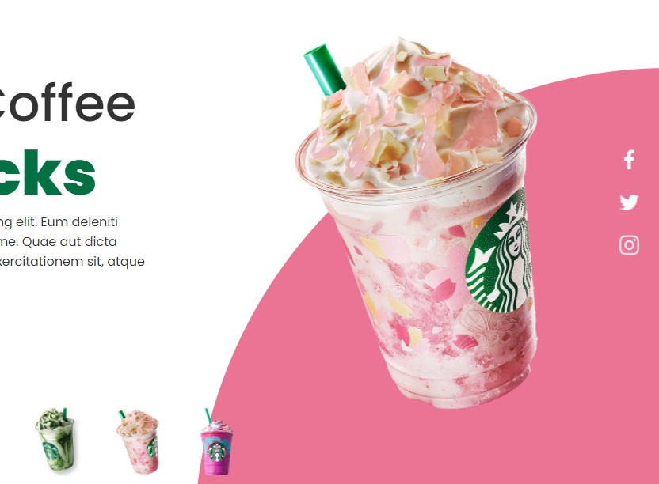
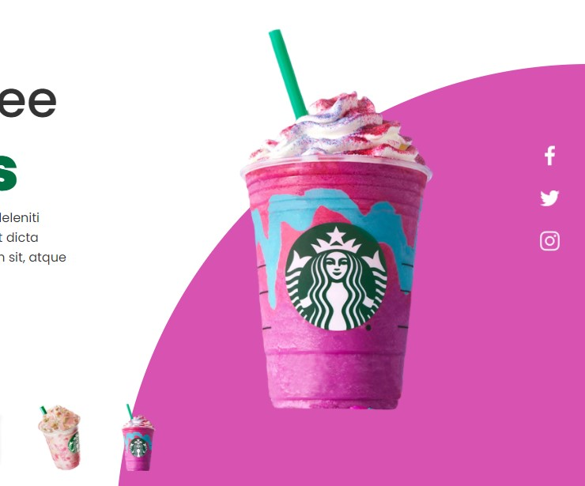

# Starbucks.

    Neste projeto uma <i>copia</i> de uma versão 
    da página da <b>Starbucks</b>. Apenas com fito de
    estudo.
    Utilize como preferir, muitos efeitos e interações 
    podem ser reaproveitas em outros projetos.

<table>
 <tr>
  <td>
   
  </td>
 </tr>
</table> 

<table>
 <tr>
  <td>
   
  </td>
  <td>
   
  </td>
 </tr>
</table>

Quer contribuir? Seja muito bem vindo e <b>vambóóóra!</b>
    
Acompanhe o desenvolvimento → [Canal códigos simples](https://www.youtube.com/channel/UC8fRZfYGd21_D8DwuEcFuHw)
 ...mais informações → <a href="https://api.whatsapp.com/send?phone=5511979714423">WhatsApp</a>

